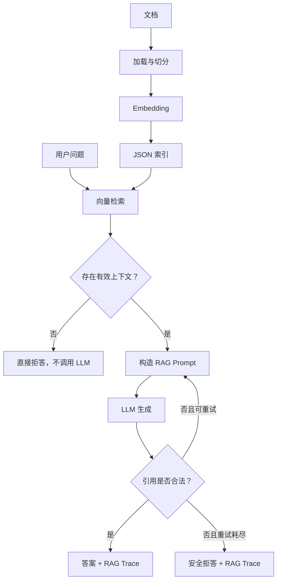

# Month02：可观测、可验证的最小 RAG Agent

本模块实现了一条可离线测试的 RAG（Retrieval-Augmented Generation，检索增强生成）核心链路，重点不只是“能够回答问题”，还包括：

- 检索格式可校验
- 检索行为可控制
- 回答引用可验证
- 异常路径可安全拒答
- 运行过程可通过 Trace 观测
- 命令行入口可被自动化测试

**RAG Core + Observability v1**

## 1. 为什么做这个项目

普通的 LLM 调用无法保证回答来自指定资料，也很难解释一次请求为什么成功或失败。本模块将文档检索结果作为回答上下文，并要求模型使用 `[S1]`、`[S2]` 等来源编号进行引用。

如果没有检索到有效上下文，系统不会调用 LLM；如果回答没有合法引用，系统会重试，并在重试耗尽后返回统一拒答，而不是输出无法验证的内容。

## 2. 系统架构



主链路：

```text
文档加载 → 文本切分 → 向量化 → 构建索引
                                   ↓
用户问题 → 查询向量化 → 相似度检索 → Prompt 构造
                                   ↓
                      LLM 生成 → 引用校验 → 答案与 Trace
```

## 3. 目录结构

```text
month02_rag_agent/
├── app.py
├── data/
│   └── demo_index.json
├── docs/
│   └── agent_infra.md
├── embedder.py
├── ingest.py
├── indexer.py
├── retriever.py
├── rag_chain.py
├── observability.py
├── demo_trace.py
└── tests/
    ├── test_demo_trace.py
    ├── test_indexer.py
    ├── test_observability.py
    ├── test_rag_chain.py
    └── test_retriever.py
```

各模块职责：

| 模块 | 职责 |
|---|---|
| `ingest.py` | 读取文档并按重叠窗口切分文本 |
| `embedder.py` | 将文本和查询转换为向量 |
| `indexer.py` | 构建、保存、加载并校验 JSON 索引 |
| `retriever.py` | 计算余弦相似度，执行 `top_k` 与 `min_score` 过滤 |
| `rag_chain.py` | 组织检索、Prompt、生成、引用校验、重试和拒答 |
| `observability.py` | 定义 `RAGResult`、`RAGTrace` 和稳定状态值 |
| `demo_trace.py` | 提供无需 API Key 的确定性离线演示 |

## 4. 核心执行接口

生产主链路使用：

```python
result = run_rag_query(...)
```

它返回 `RAGResult`，其中同时包含：

```python
result.answer
result.trace
```

`answer_query()` 保留为兼容接口，只返回答案字符串。需要观测、评测或排查问题时，应调用 `run_rag_query()`，否则会丢失 Trace。

## 5. 离线运行 Trace Demo

以下命令均从仓库根目录执行，不需要 API Key，也不会访问网络。

### 5.1 成功回答

```bash
python3 -m month02_rag_agent.demo_trace --scenario success
```

预期关键结果：

```text
status: success
retrieved_count: 1
llm_calls: 1
citation_retries: 0
citations: ["S1"]
```

### 5.2 无有效上下文

```bash
python3 -m month02_rag_agent.demo_trace --scenario no-context
```

预期关键结果：

```text
answer: 资料不足，无法回答
status: no_context
retrieved_count: 0
llm_calls: 0
```

### 5.3 引用校验失败并拒答

```bash
python3 -m month02_rag_agent.demo_trace --scenario citation-refused
```

预期关键结果：

```text
answer: 资料不足，无法回答
status: citation_refused
retrieved_count: 1
llm_calls: 2
citation_retries: 1
citations: []
```

三个 Demo 场景使用固定向量和预设 LLM 响应，目的是稳定复现控制流与 Trace 契约，不用于衡量真实模型的回答质量。

## 6. RAG Trace

每次主链路执行都会生成结构化 Trace：

| 字段 | 含义 |
|---|---|
| `query` | 用户问题 |
| `retrieved_count` | 通过阈值过滤的检索结果数量 |
| `top_score` | 最高相似度；无结果时为 `null` |
| `citations` | 最终答案中通过校验的来源编号 |
| `llm_calls` | 本次请求实际调用 LLM 的次数 |
| `citation_retries` | 因引用不合法而发生的重试次数 |
| `status` | 稳定、低基数的执行状态 |
| `duration_seconds` | 主链路执行耗时 |

当前状态值：

| 状态 | 含义 |
|---|---|
| `success` | 检索到上下文，且回答引用合法 |
| `no_context` | 没有结果通过检索阈值，跳过 LLM 并拒答 |
| `citation_refused` | 引用校验持续失败，重试耗尽后拒答 |

`duration_seconds` 是动态值，测试只验证其大于等于零，不断言固定耗时。

## 7. 关键安全与稳定性设计

### 7.1 无上下文不生成

当所有结果都低于 `min_score` 时，系统直接返回“资料不足，无法回答”，并保持 `llm_calls == 0`。这既降低幻觉风险，也避免无效模型调用。

### 7.2 引用属于输出契约

生成答案必须至少包含一个合法来源编号，并且所有引用都必须来自本次检索结果。无引用或引用未知来源都会触发重试。

### 7.3 重试有明确上限

引用错误不会无限重试。重试耗尽后系统返回统一拒答，并将状态记录为 `citation_refused`。

### 7.4 状态保持低基数

Trace 的 `status` 使用固定枚举，不把异常文本、查询内容等高基数信息写入状态字段，便于后续聚合监控与告警。

### 7.5 索引加载执行契约校验

索引加载时会检查 JSON 结构、Embedding 模型名、向量维度、归一化标记及记录字段，防止损坏或不兼容的索引进入检索链路。

## 8. 测试

运行 Month02 全量测试：

```bash
PYTEST_DISABLE_PLUGIN_AUTOLOAD=1 python3 -m pytest \
  month02_rag_agent/tests \
  -v
```

当前预期：

```text
66 passed
```

测试分层：

| 测试文件 | 验证内容 |
|---|---|
| `test_indexer.py` | 索引构建、持久化、加载和契约校验 |
| `test_retriever.py` | 余弦相似度、Top-K、阈值和非法参数 |
| `test_rag_chain.py` | RAG 主链路、引用校验、重试及拒答 |
| `test_observability.py` | Trace 状态、数据保留和 JSON 序列化 |
| `test_demo_trace.py` | 从独立进程启动 CLI，验证端到端 JSON 契约 |

这里需要区分：

- 单元测试验证局部函数或类的契约；
- CLI 冒烟测试快速确认真实入口和关键主链路能够协同运行；
- 全量回归测试确认新增改动没有破坏已有能力；
- 多轮重复执行并统计成功率、P50/P95 和偶发失败属于稳定性评测。

## 9. 已完成能力

- [x] 文档读取与重叠切分
- [x] 本地 Embedding 接口
- [x] JSON 向量索引
- [x] 严格索引契约校验
- [x] 余弦相似度检索
- [x] `top_k` 与 `min_score` 过滤
- [x] RAG Prompt 构造
- [x] 来源编号与引用校验
- [x] 引用错误重试和安全拒答
- [x] RAG Trace 可观测性
- [x] 三类确定性离线 Demo
- [x] CLI 冒烟测试
- [x] 66 项自动化测试

## 10. 当前边界与下一阶段

当前版本聚焦于“正确、可测、可解释”的最小 RAG 核心，还没有把以下能力当作已完成特性：

- 大规模向量数据库；
- 混合检索与 Reranker；
- 面向真实数据集的 Recall@K、MRR 等检索评测；
- 并发查询、缓存、限流与服务化部署；
- Prompt、Embedding 和索引版本管理；
- 线上指标、日志聚合与告警。

后续将以当前稳定契约为基础，继续扩展评测、服务化和生产可观测性能力。

## 11. 面试讲解主线

可以用下面四句话概括本模块：

> 我实现了一条最小 RAG 链路，将文档切分、向量索引、相似度检索、LLM 生成和引用校验串联起来。系统在没有有效上下文时不会调用 LLM，在引用不合法时进行有限重试并安全拒答。主接口返回答案和结构化 Trace，可观测检索数量、最高分、LLM 调用次数、引用重试和最终状态。最后通过单元测试、CLI 冒烟测试与全量回归验证这条链路，共有 66 项测试通过。
