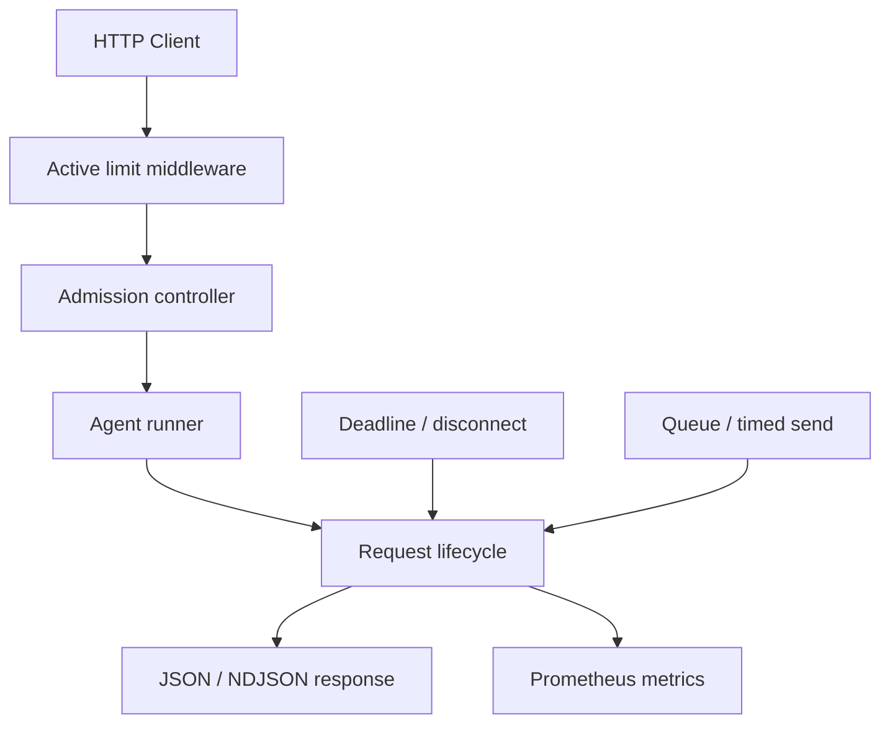
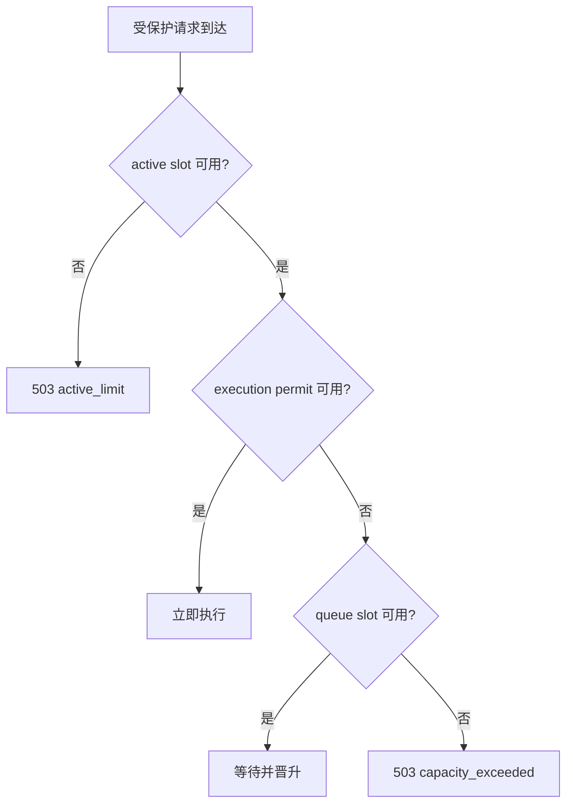
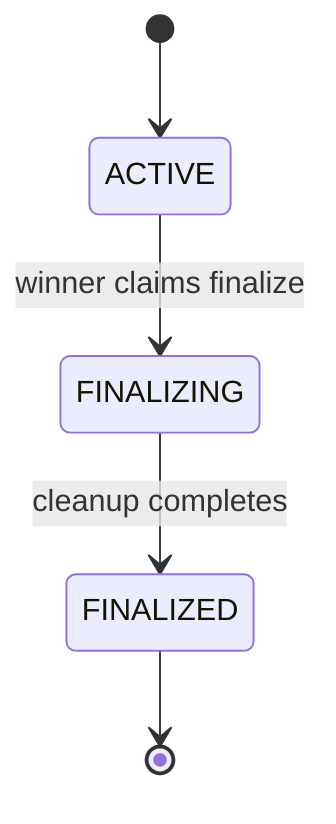
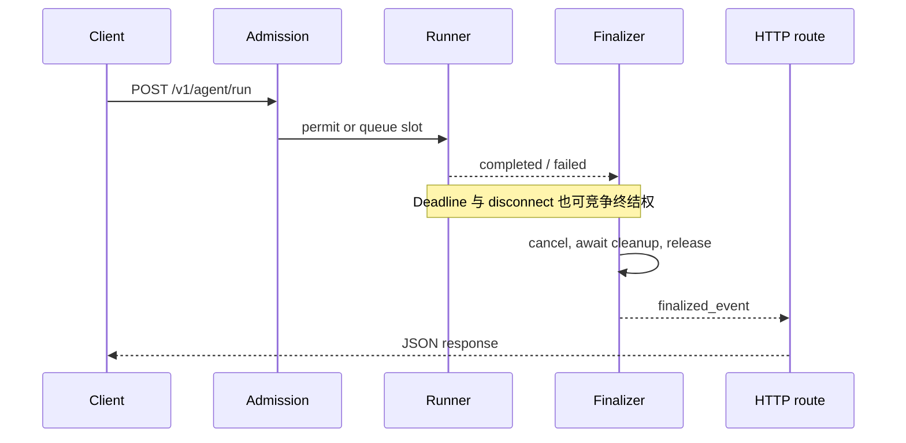
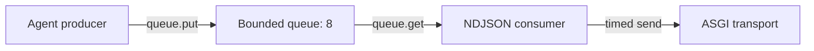
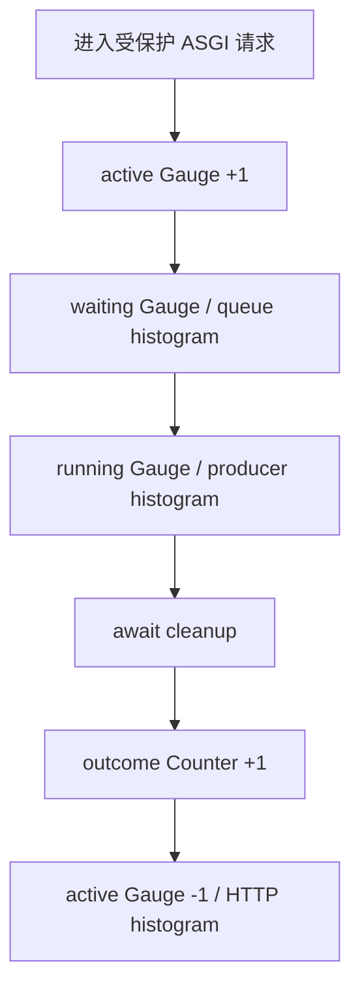

# Month04 架构与生命周期

本文记录异步 Agent 服务的关键控制流和设计不变量。它关注的是“请求如何可靠结束”，不是 Agent 的业务实现。

## 1. 组件关系



| 组件 | 职责 | 不负责的事情 |
|---|---|---|
| Active middleware | 限制完整 ASGI 请求数量；统计 HTTP 生命周期 | 不决定 Agent 是否获得执行名额 |
| Admission controller | 分配执行 permit 或排队 slot | 不决定最终业务结果 |
| Runner | 执行 Agent，保存结果或错误 | 不重复处理外部取消造成的终结 |
| Lifecycle | 仲裁唯一终结者、取消、清理和发布终态 | 不执行具体 Agent 业务 |
| Streaming response | 消费 Token、限制发送时间、记录传输结果 | 不把传输失败和业务结果混为一个字段 |
| Metrics | 在状态边界发生时记录指标 | 不改变生命周期状态 |

## 2. 三层容量模型



### 容量不变量

```text
0 <= running_requests <= max_running
0 <= waiting_requests <= max_waiting
0 <= active_requests <= max_active
```

三个 Gauge 不能简单相加：

- `active_requests` 是外层 HTTP 生命周期。
- `running_requests` 和 `waiting_requests` 是内层业务容量状态。
- active slot 还覆盖响应发送和清理阶段。
- 被内层容量拒绝的请求会快速释放 active slot，后续请求可能复用它。

因此，同一批突发请求中既可能出现 `active_limit`，也可能出现 `capacity_exceeded`；具体分布受任务到达和释放时序影响。

## 3. 请求状态机



可能竞争终结权的事件：

- `COMPLETED`
- `DEADLINE_EXCEEDED`
- `CLIENT_DISCONNECTED`
- `INTERNAL_ERROR`
- `SEND_TIMEOUT`
- `RESPONSE_DEADLINE_EXCEEDED`

`try_claim_finalize()` 在 `asyncio.Lock` 临界区内同时完成：

1. 检查当前阶段是否仍是 `ACTIVE`。
2. 校验 Deadline 事件是否真正生效。
3. 选择业务终态。
4. 把阶段改为 `FINALIZING`。

检查和修改必须在同一临界区内，否则两个并发事件都可能观察到 `ACTIVE` 并重复清理。

锁释放后，唯一终结者才执行可能阻塞的清理：

```text
设置 cancel_event
→ task.cancel()
→ await task 真正退出
→ 释放 queue slot / execution permit
→ 记录业务结果 Counter
→ 发布 FINALIZED
```

不能持有 `state_lock` 等待后台任务退出，否则后台任务或其他终结参与者可能也需要该锁，形成死锁。

## 4. 非流式请求时序



路由不是等待某个固定 Task，而是等待 `ctx.finalized_event`。这样，无论完成、超时、断连还是异常赢得竞争，路由都观察同一个最终完成信号。

## 5. 流式背压链路



当客户端接收缓慢时：

1. `send()` 变慢。
2. Consumer 消费队列变慢。
3. 有界队列逐渐填满。
4. Producer 阻塞在 `await queue.put(token)`。
5. 生成速度被消费速度反向限制，避免 Token 无限堆积导致内存增长。

队列满并不意味着生产者可以提前结束。取消时也必须关闭异步生成器，并等待其 `finally` 清理完成，才能释放 execution permit。

## 6. 三种时间预算

| 时间预算 | 覆盖范围 | 触发结果 |
|---|---|---|
| Business deadline | Agent 业务生命周期 | `timed_out` |
| Send timeout | 单次 ASGI `send(message)` | 传输 `send_timed_out`，业务取消 |
| Response deadline | 整个流式响应，包括等待和发送 | 传输 `response_timed_out`，业务超时 |

单次发送超时不能代替响应总 Deadline：每次发送都低于单次阈值时，整个响应仍可能无限拖长。

## 7. 业务结果与传输结果

`RequestContext` 分开保存：

- `outcome`：`succeeded/timed_out/cancelled/failed`
- `transport_outcome`：`sent/disconnected/send_timed_out/cancelled/failed/response_timed_out`

分离的原因是业务完成和网络发送不是同一件事。例如 Agent 已成功生成结果，但发送最后一个响应体时客户端断开。此时不能用传输失败覆盖业务事实，也不能假装响应已经成功到达客户端。

## 8. 指标边界



关键点：

- Gauge 必须在获得资源后增加，在真正释放资源时减少。
- 排队等待即使被取消，也应留下 `result="cancelled"` 的等待样本。
- 没有进入生产阶段的请求不记录 `0 s` 生产者样本。
- 总请求耗时包含生产、发送和清理，但这些阶段可能重叠，不能把各阶段 Histogram 的平均值直接相加。

## 9. 当前边界

这是单进程内的可靠性模型。若扩展到多 Worker 或多副本，需要继续解决：

- 跨进程容量协调
- 多进程 Prometheus 指标模式
- 分布式取消和租约
- 队列持久化与崩溃恢复
- 全链路 Trace 与真实模型/GPU 指标关联
