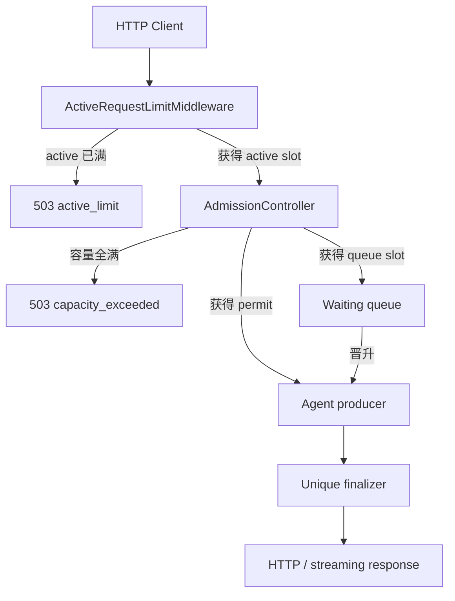

# Month04 — Reliable Async Agent Service

一个面向 Agent Runtime 场景的异步 FastAPI 服务原型。项目重点不是业务回答质量，而是请求在并发、排队、超时、断连、流式背压和竞态条件下能否可靠结束，并且让容量与生命周期可以被测试和观测。

## 核心能力

- 非流式接口：`POST /v1/agent/run`
- NDJSON 流式接口：`POST /v1/agent/stream`
- 三层容量控制：活跃请求、执行名额、排队名额
- 请求状态机：`ACTIVE -> FINALIZING -> FINALIZED`
- 业务超时、单次发送超时和流式响应总截止时间
- 客户端断连与后台任务取消
- 有界 Token 队列和背压
- 唯一终结者与幂等资源释放
- Prometheus Counter、Gauge、Histogram
- 可重复的异步测试与突发负载实验

更详细的状态迁移、容量不变量和流式链路见 [ARCHITECTURE.md](ARCHITECTURE.md)。面试口述版本见 [INTERVIEW_GUIDE.md](INTERVIEW_GUIDE.md)。

## 架构概览



三个容量参数解决不同问题：

| 参数 | 控制对象 | 作用 |
|---|---|---|
| `max_active` | 完整 ASGI 请求生命周期 | 限制路由、响应发送和清理占用的总资源 |
| `max_running` | 持有 execution permit 的生产者 | 限制真正并发执行的 Agent 数量 |
| `max_waiting` | 持有 queue slot 的等待者 | 限制服务内部允许排队的请求数量 |

## 目录结构

```text
month04_deploy/
├── app/
│   ├── active_requests.py      # ASGI 层 active 限流与 HTTP 总耗时
│   ├── admission.py            # running/waiting 容量控制
│   ├── api.py                  # FastAPI 路由与依赖组装
│   ├── client_disconnect.py    # 非流式请求断连监视
│   ├── deadline_monitor.py     # 业务截止时间监视
│   ├── load_app.py             # 0.5 秒模拟负载应用
│   ├── metrics.py              # 独立 Prometheus Registry
│   ├── request_context.py      # 请求状态、结果和资源句柄
│   ├── request_lifecycle.py    # 唯一终结与资源清理
│   ├── request_runner.py       # 非流式生产者
│   ├── send_timeout.py         # 单次 ASGI send 超时
│   ├── stream_consumer.py      # Token 队列消费与 NDJSON 编码
│   ├── stream_response.py      # 流式传输生命周期
│   └── stream_runner.py        # 流式生产者
├── tests/                      # 生命周期、竞态、容量和指标测试
├── load_test.py                # 异步突发负载脚本
├── requirements.txt
└── requirements-dev.txt
```

## 快速开始

以下命令从仓库根目录执行。

### 1. 安装依赖

```bash
conda activate agent-dev

python3 -m pip install \
    -r month04_deploy/requirements.txt \
    -r month04_deploy/requirements-dev.txt
```

### 2. 启动默认演示服务

```bash
python3 -m uvicorn \
    month04_deploy.app.api:app \
    --host 127.0.0.1 \
    --port 8000
```

### 3. 健康检查

```bash
curl http://127.0.0.1:8000/health
```

预期输出：

```json
{"status":"ok"}
```

### 4. 非流式请求

```bash
curl -sS \
    -X POST http://127.0.0.1:8000/v1/agent/run \
    -H 'content-type: application/json' \
    -d '{"prompt":"hello","timeout_seconds":3}'
```

成功响应示例：

```json
{
  "request_id": "...",
  "outcome": "succeeded",
  "result": "echo:hello",
  "error": null
}
```

### 5. 流式请求

```bash
curl -N -sS \
    -X POST http://127.0.0.1:8000/v1/agent/stream \
    -H 'content-type: application/json' \
    -d '{"prompt":"hello","timeout_seconds":3}'
```

接口使用 `application/x-ndjson`，每一行都是独立 JSON：

```jsonl
{"type":"token","data":"收到："}
{"type":"token","data":"hello"}
{"type":"token","data":"，"}
{"type":"token","data":"处理完成。"}
{"type":"done","request_id":"...","outcome":"succeeded","error":null}
```

流式响应头一旦发送，后续业务超时不能再把 HTTP 状态码改成 `504`，因此最终业务结果放在 `done` 事件中。

### 6. Prometheus 指标

```bash
curl -sS http://127.0.0.1:8000/metrics
```

服务使用独立 `CollectorRegistry`，避免测试和多应用实例之间发生全局指标重名。

## 请求终态与 HTTP 表达

| 业务终态 | 非流式 HTTP 状态 | 含义 |
|---|---:|---|
| `succeeded` | 200 | 业务成功并完成清理 |
| `timed_out` | 504 | 业务 Deadline 或流式响应 Deadline 超时 |
| `cancelled` | 499 | 客户端断连或发送超时导致取消 |
| `failed` | 500 | Agent 或内部执行异常 |

`499` 是服务内部采用的非标准客户端关闭状态表达；经过代理或网关时，需要结合实际平台的状态码约定。

## 指标说明

| 指标 | 类型 | 记录边界 |
|---|---|---|
| `agent_active_requests` | Gauge | 当前持有 active slot 的受保护 HTTP 请求 |
| `agent_running_requests` | Gauge | 当前持有 execution permit 的请求 |
| `agent_waiting_requests` | Gauge | 当前持有 queue slot 的请求 |
| `agent_http_request_duration_seconds` | Histogram | 受保护接口从进入中间件到响应发送及下游清理完成 |
| `agent_queue_wait_seconds{result}` | Histogram | 等待执行名额的时间，结果为 `acquired/cancelled/error` |
| `agent_producer_duration_seconds` | Histogram | 生产者获得执行名额后到其内部清理完成的生命周期 |
| `agent_request_outcomes_total{outcome}` | Counter | 清理完成后确认的业务终态 |
| `agent_admission_rejections_total{reason}` | Counter | `active_limit` 或 `capacity_exceeded` 拒绝次数 |

重要边界：

- 未获得执行名额的请求不记录生产者耗时，避免大量 `0 s` 样本稀释平均值。
- `producer_duration` 包含生成器关闭和可能发生的背压等待，不能直接解释为模型纯计算时间。
- 取消请求只发出取消信号时不能释放 permit；必须 `await` 后台任务真正退出并完成清理。
- `request_outcomes_total` 在唯一终结者完成清理后增加，而不是在刚收到完成或取消事件时增加。
- Counter 和 Histogram 是进程启动以来的累计值；Gauge 才表示采样瞬间的当前状态。

## 运行测试

```bash
PYTEST_DISABLE_PLUGIN_AUTOLOAD=1 \
python3 -m pytest \
    -p pytest_asyncio.plugin \
    -q month04_deploy/tests
```

测试覆盖：

- 成功、超时、异常和断连
- 完成与 Deadline 的竞态
- 唯一终结者和幂等清理
- 有界队列背压
- 流式消费者辅助 Task 回收
- 单次发送超时和整个响应超时
- waiting/running/active Gauge 生命周期
- 排队取消和生产者取消的指标边界
- 两层容量拒绝 Counter

## 负载实验

启动专用模拟应用：

```bash
python3 -m uvicorn \
    month04_deploy.app.load_app:app \
    --host 127.0.0.1 \
    --port 8000
```

另开终端执行：

```bash
conda activate agent-dev

python3 month04_deploy/load_test.py \
    --requests 12 \
    --concurrency 12 \
    --business-timeout 3
```

`load_app.py` 使用每个请求约 `0.5 s` 的模拟 Agent。两次突发实验得到：

| 实验 | 容量配置 | 成功 | 拒绝 | 成功请求 P95 | 成功吞吐 |
|---|---|---:|---:|---:|---:|
| 内部容量先满 | running=2, waiting=3, active=8 | 5 | 7 `capacity_exceeded` | 1.518 s | 3.28 req/s |
| active 层先满 | running=2, waiting=30, active=4 | 4 | 8 `active_limit` | 1.045 s | 3.83 req/s |

实验结论：

1. 理论稳态业务吞吐由执行并发和单请求服务时间决定：`2 / 0.5 ≈ 4 req/s`。
2. 增大等待队列只能吸收突发，不能提高理论稳定吞吐。
3. 把快速 `503` 与成功请求混在一起计算总体 P50，会让服务看起来“延迟很低”。因此必须按结果拆分延迟，并单独报告成功吞吐率。
4. 突发请求到达、快速拒绝、任务结束和 active slot 复用可以同时发生，拒绝分布不是简单的静态容量减法。

这些结果来自小规模本地模拟负载，不代表真实 LLM 或 GPU 推理性能。

## 核心设计不变量

1. 任意请求只能有一个终结者。
2. `state_lock` 只保护状态检查与迁移，不能在持锁时等待外部任务退出。
3. `cancel()` 只是请求取消；资源必须在任务真正退出后释放。
4. queue slot 和 execution permit 只释放一次，并同步更新上下文标志与 Gauge。
5. 流式生产者必须通过有界队列感知慢消费者形成的背压。
6. 业务结果与传输结果分开记录，避免发送失败覆盖已经确定的业务语义。

## 阶段边界

本阶段实现的是单进程、单事件循环内的可靠性原型。当前未实现：

- 跨进程或分布式全局容量控制
- 外部持久化队列和故障恢复
- 多副本 Prometheus 指标聚合
- 真实模型 Token 指标与 GPU Kernel Profiling
- 生产级鉴权、限流策略和服务发现

下一阶段将进入 GPU Profiling，把请求级指标继续拆解为 CPU 调度、数据传输、GPU Kernel、Prefill、Decode、TTFT 和 TPOT。
